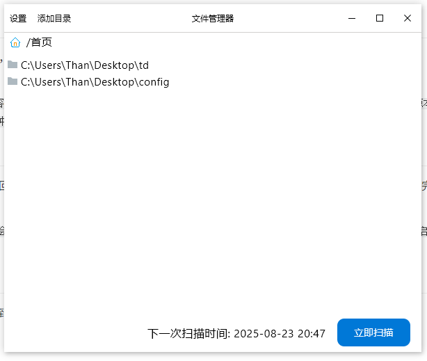
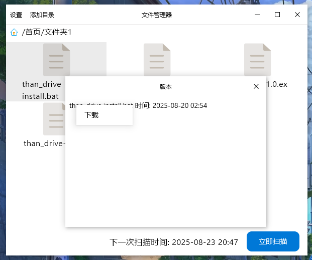
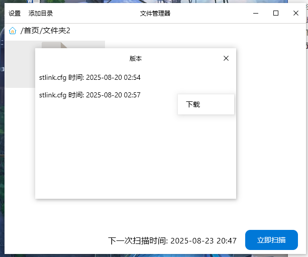
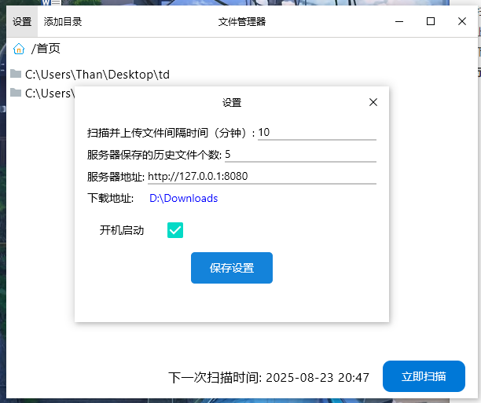
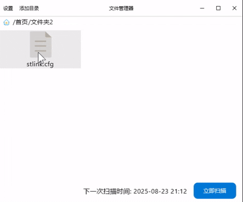

# 背景

起因是我希望有一款软件可以自动扫描指定目录的变动文件（类似于git，但是是自动化的），将其上传到服务器。然后我去网上找了一些符合的软件，最出名的莫过于OneDrive，但是由于各种原因，并不是很好用，于是我大概盘算了一下，这种软件其实并不复杂，于是就自己动手写了一个。

# 功能描述

简单概述一下主要的功能，一些比较细微的功能就略过了

## 扫描功能

这是基础功能之一，会递归扫描指定文件夹下方文件，将有所变动的文件的路径记录，每扫描完一个文件夹就会检测一次计算机的资源占用（有考虑将其变为更加频繁），保证只在电脑空闲时工作

`其中文件是否变动，主要是比对文件的修改时间和 文件内容+文件名 的md5值。至于资源占用的检测，有考虑使用守护线程将其挂在后台，但是第一检测资源本身需要一定性能，并且考虑到普通用户的文件夹并不会嵌套太深，所以暂时使用这种方式，有需求再添加`

## 上传功能

当扫描完成后，会将扫描到的变动文件路径记录，返回一个集合，然后自动上传至服务器，每上传一个文件会采样一次系统占用状态，上传完成后会进入一个等待时间，然后进入下一次扫描。

`其中等待时间是用户可以自己设置的，程序在第一次启动，会生成一个配置文件，用户可以使用ui界面修改，也可以直接修改配置文件，然后再重启程序，重启的目的是为了加载到配置文件`

## 下载功能

为了将ui界面和守护程序解耦，所以将下载功能集成到了守护程序中，具体使用方法会在后续写入文档。

`我已经写了一个默认的ui界面可供参考`

其实总结起来大概就这些功能，本意就是开发一个小工具，所以功能并不多。

# 展示

简单的图文展示一下，主要是通过ui查看功能，下面直接贴图

`这里的开机启动是ui的开机启动，暂时未实现，至于守护程序是默认开机启动的（不吃资源，并不会拖延开机时间）`

这里将stlink.cfg修改一下，然后立即扫描，看会不会多出一个版本

可以看到，这里多出来了一个版本。并且其他未被修改的文件也没有被重复上传。

# 关于部署

这一整套程序分为了三部分，第一部分是展示中的守护程序，第二部分是展示的ui，最后一部分是后端。将三端分离的好处是可以分离部署，其中ui和守护程序通过tcp通讯，这样做的好处是可以将两部分完全解耦，这样如果你对ui不满意，你可以在不修改守护程序的情况下，通过任何语言，任何框架重新开发一套自己喜欢的ui，并且，可以将ui和守护程序部署在局域网（或者能直接或间接通讯的）不同的电脑上，只需要开放相应的端口即可。而我目前也在考虑添加一个命令行控制，这样就可以完全将其与ui分离，可以做到即使没有ui，也可以独立运行，虽然整套为java开发，但是其实内存和空间占用也不是特别高，守护程序在16g内存下占用在1%及以下，打包的程序在7MB左右（可以更小）。后端可以部署在服务器上，在守护程序的配置文件中，可以修改要通讯的服务器地址和端口，安全起见，还可以设置通讯密码。如果你没有服务器，也可以部署在同一台电脑上，目前使用的是springboot，后面考虑为在同一台电脑使用的场景下，做一个更轻量的后端程序，或者直接将两部分合二为一。

# 安全问题

这是一个开源项目，所有代码透明开放。
